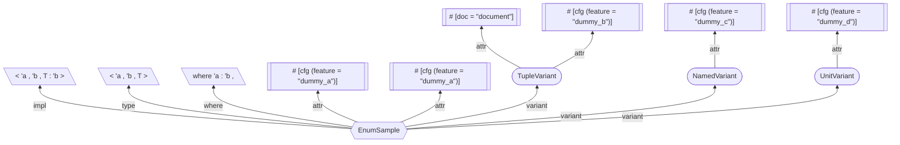

```mermaid
---
title:enum
---
flowchart BT
	12@{ shape: stadium,label: "UnitVariant" }
	13@{ shape: subroutine,label: "#35; [cfg (feature = \"dummy_d\")]" }
	4@{ shape: lean-l,label: "where 'a : 'b ," }
	2@{ shape: lean-l,label: "< 'a , 'b , T : 'b >" }
	5@{ shape: subroutine,label: "#35; [cfg (feature = \"dummy_a\")]" }
	3@{ shape: lean-l,label: "< 'a , 'b , T >" }
	1@{ shape: hexagon,label: "EnumSample" }
	7@{ shape: stadium,label: "TupleVariant" }
	6@{ shape: subroutine,label: "#35; [cfg (feature = \"dummy_a\")]" }
	8@{ shape: subroutine,label: "#35; [cfg (feature = \"dummy_b\")]" }
	10@{ shape: stadium,label: "NamedVariant" }
	9@{ shape: subroutine,label: "#35; [doc = \"document\"]" }
	11@{ shape: subroutine,label: "#35; [cfg (feature = \"dummy_c\")]" }
	7 -- "attr" --> 9
	1 -- "attr" --> 6
	7 -- "attr" --> 8
	1 -- "type" --> 3
	1 -- "variant" --> 7
	1 -- "where" --> 4
	1 -- "variant" --> 10
	1 -- "attr" --> 5
	10 -- "attr" --> 11
	1 -- "variant" --> 12
	12 -- "attr" --> 13
	1 -- "impl" --> 2
```
